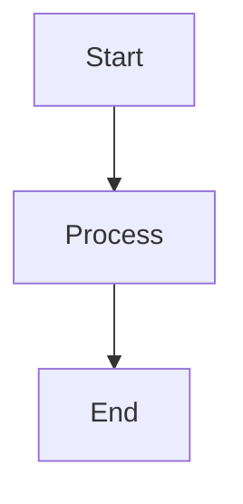
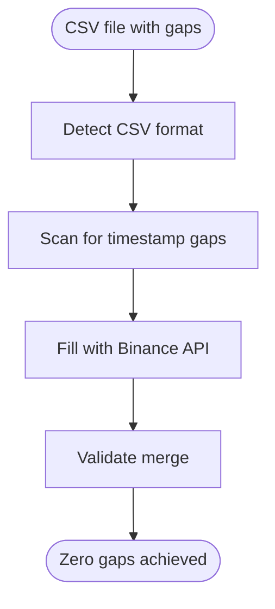

# Gapless Crypto Data - Architecture Diagrams

This directory contains Mermaid flowcharts visualizing the core business logic and technical architecture of the gapless-crypto-data system. These diagrams provide a comprehensive visual reference for developers, maintainers, and users to understand the data collection pipeline, gap-filling strategy, validation flows, and performance optimizations.

## Phase 1 Diagrams (Production-Ready)

### 1. End-to-End Collection Pipeline

**File**: `01-collection-pipeline.mmd`
**Reference**: `src/gapless_crypto_data/collectors/binance_public_data_collector.py:732-943`

Visualizes the complete data collection journey from user request through download, validation, and saving. Key flows include:

- Parameter validation and collector initialization
- ETag-based caching decision logic
- CloudFront CDN response handling (304 vs 200)
- Daily file fallback strategy for incomplete months
- Auto gap-filling integration
- Final data formatting and return

**Key Concepts**: Dual data source strategy, 22x performance advantage, atomic file operations

---

### 2. Gap Detection and Filling Workflow

**File**: `02-gap-filling.mmd`
**Reference**: `src/gapless_crypto_data/gap_filling/universal_gap_filler.py:597-644`

Shows the zero-gap guarantee process using authentic Binance API data. Covers:

- CSV format detection (enhanced 11-col vs legacy 6-col)
- Timestamp sequence scanning and gap identification
- Binance API integration for gap filling
- Data merge and deduplication strategy
- Atomic save operations with backup/restore

**Key Concepts**: Zero-gap guarantee, authentic vs synthetic data, format migration support

---

### 3. Multi-Symbol Multi-Timeframe Orchestration

**File**: `03-multi-symbol-collection.mmd`
**Reference**: `src/gapless_crypto_data/cli.py:424-470`

Complex nested loop orchestration with intelligent checkpointing and resume capability. Features:

- Checkpoint-based resume logic for interrupted runs
- Symbol loop → Timeframe loop hierarchy
- Progress tracking and state preservation
- Interruption handling (Ctrl+C graceful shutdown)
- Final summary generation and checkpoint cleanup

**Key Concepts**: Intelligent checkpointing, parameter validation, resume capability

---

### 4. Download with ETag Caching Strategy

**File**: `04-download-caching.mmd`
**Reference**: `src/gapless_crypto_data/collectors/binance_public_data_collector.py:354-481`

Explains the 22x performance advantage through HTTP ETag conditional requests. Details:

- ETag cache structure and lookup
- Conditional vs full HTTP requests
- CloudFront CDN architecture (400+ edge locations)
- 304 Not Modified vs 200 OK handling
- Performance comparison: cached (0 bytes, 380ms) vs fresh (180MB, 8-15s) vs API-only (3-5 minutes)

**Key Concepts**: Immutable historical data, CDN optimization, bandwidth savings

---

### 5. Data Validation Decision Tree

**File**: `05-validation-flow.mmd`
**Reference**: `src/gapless_crypto_data/validation/csv_validator.py:170-232`

Multi-layer validation strategy ensuring data quality. Includes:

- **Layer 1**: Structure validation (11-col enhanced vs 6-col legacy)
- **Layer 2**: DateTime validation (parsing, sorting, gap detection, duplicates)
- **Layer 3**: OHLCV quality (price logic, volume checks, range validation)
- **Layer 4**: Coverage validation (actual vs expected bar count)
- **Layer 5**: Anomaly detection (price spikes, flash crashes)

**Key Concepts**: Multi-layer validation, quality assurance, anomaly detection

---

## Embedding Instructions

### Method 1: Direct File Reference (Recommended for GitHub)

GitHub natively renders Mermaid diagrams from `.mmd` files when using code blocks:

````markdown
# Architecture Overview


````

````

For local `.mmd` files, include them inline:

```markdown
# Data Collection Pipeline

See the complete flow in [01-collection-pipeline.mmd](./docs/diagrams/01-collection-pipeline.mmd)
````

### Method 2: Inline Embedding

Copy the Mermaid syntax directly into your markdown document:

````markdown
# Gap Filling Process


````

````

### Method 3: Mermaid Live Editor (For External Sharing)

1. Visit https://mermaid.live
2. Paste diagram content from `.mmd` file
3. Export as PNG/SVG for presentations or external documentation
4. Embed image:

```markdown

````

### Method 4: VS Code Preview

Install the "Markdown Preview Mermaid Support" extension to preview diagrams directly in VS Code while editing markdown files.

---

## Usage Examples

### In API Documentation

````markdown
## Data Collection Flow

The `BinancePublicDataCollector` follows this flow:

```mermaid
[Copy from 01-collection-pipeline.mmd]
```
````

See `src/gapless_crypto_data/collectors/binance_public_data_collector.py` for implementation.

````

### In Architecture Decision Records (ADRs)

```markdown
## Decision: ETag-Based Caching

Context: Historical data is immutable, allowing aggressive caching.

Decision: Implement HTTP ETag conditional requests for 22x performance.

Consequences:
- Bandwidth savings: 0 bytes on cache hits vs 180MB downloads
- Latency reduction: 380ms RTT vs 8-15s download time

```mermaid
[Copy from 04-download-caching.mmd]
````

````

### In User Guides

```markdown
## Understanding Gap Filling

When gaps are detected in your data, the system automatically fills them with authentic Binance API data:

```mermaid
[Copy from 02-gap-filling.mmd]
````

This ensures your datasets have zero gaps without using synthetic data.

````

---

## Rendering Instructions

### Local Development

**Supported Viewers**:
- VS Code with "Markdown Preview Mermaid Support" extension
- PyCharm/IntelliJ with Mermaid plugin
- Obsidian (native support)
- Typora (native support)

**CLI Rendering**:
```bash
# Install Mermaid CLI
npm install -g @mermaid-js/mermaid-cli

# Render to PNG
mmdc -i 01-collection-pipeline.mmd -o collection-pipeline.png

# Render to SVG
mmdc -i 02-gap-filling.mmd -o gap-filling.svg
````

### GitHub

GitHub automatically renders Mermaid diagrams in:

- README.md files
- Pull request descriptions
- Issue comments
- Wiki pages

Simply use triple backtick code blocks with `mermaid` language identifier.

### Documentation Sites

**MkDocs**: Install `mkdocs-mermaid2-plugin`

```yaml
# mkdocs.yml
plugins:
  - mermaid2
```

**Sphinx**: Install `sphinxcontrib-mermaid`

```python
# conf.py
extensions = ['sphinxcontrib.mermaid']
```

**Docusaurus**: Native Mermaid support in v2.0+

---

## Diagram Maintenance

### Updating Diagrams

When updating business logic, ensure corresponding diagrams are updated:

1. Identify affected diagram(s) from the "Reference" line in each diagram
2. Update `.mmd` file with new logic flows
3. Validate syntax at https://mermaid.live
4. Update code reference comments if line numbers changed
5. Commit with descriptive message:

   ```
   docs(diagrams): Update gap-filling flow for new API endpoint

   - Add retry logic to API call section
   - Update reference to universal_gap_filler.py:612-658
   ```

### Adding New Diagrams

Follow the established naming convention:

- `NN-descriptive-name.mmd` (where NN is sequential number)
- Update this README with new diagram entry
- Include reference to source code location
- Add color-coded styling for consistency

---

## Style Guide

All diagrams follow these conventions:

**Color Coding**:

- Red (`errorNode`): Error states and failures
- Yellow (`warnNode`): Warnings and non-critical issues
- Green (`successNode`): Success states and completions
- Blue (`criticalNode`): Critical decision points and core logic
- Gray (`dataNode`): Data processing operations

**Node Shapes**:

- `([Rounded box])`: Start/End points
- `[Rectangle]`: Process steps
- `{Diamond}`: Decision points
- `[/Parallelogram/]`: Input/Output operations

**Annotations**:

- Use `note1[...]` for technical context
- Include performance metrics where relevant
- Reference actual code locations with file:line notation

---

## Contributing

When adding new diagrams:

1. Follow Phase 1 patterns for structure and styling
2. Include comprehensive annotations
3. Reference specific code locations
4. Test rendering on GitHub before committing
5. Update this README with diagram description

For questions or suggestions, open an issue with the `documentation` label.
